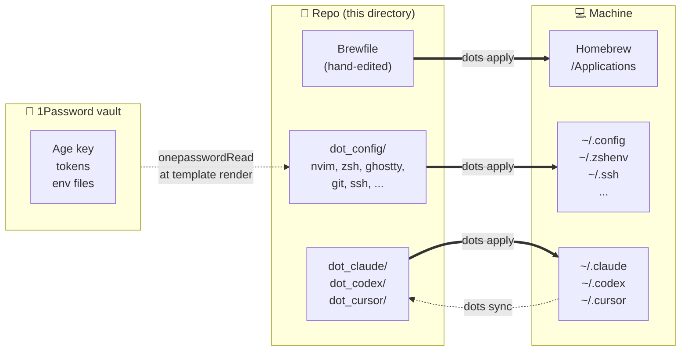

# Personal Dotfiles (Chezmoi)

Opinionated macOS dotfiles managed by [chezmoi](https://www.chezmoi.io/) for
a single daily-driver Mac. Repo is the declarative source of truth for the
shell, editor, package list, and other authored configs. AI tool state
(`~/.claude`, `~/.codex`, `~/.cursor`) is captured from the machine on
demand because skills/agents/plugins churn too fast to hand-maintain.

> **Fair Warning**: highly personal setup. Fork and adapt — don't expect a
> plug-and-play experience on a different person's workflow.

## Quick start (new machine)

Prereqs — see [`SETUP.md`](SETUP.md) for detail:

1. macOS installed; user account created
2. `xcode-select --install`
3. 1Password app installed + signed in (enable SSH agent + CLI integration)
4. 1Password CLI installed + authenticated (`op signin`)

Then:

```bash
curl -fsSL https://raw.githubusercontent.com/jarodtaylor/dotfiles/main/bootstrap.sh | bash
```

That:

- Installs Homebrew, chezmoi, and age (needed at init time)
- Clones this repo + runs `chezmoi apply`
- Brewfile installs ~100 entries (58 brew + 33 casks + 8 MAS + 3 taps)
- Configs are rendered with secrets pulled from 1Password

Total: ~5 minutes of active clicks + 30–60 minutes walkaway.

After bootstrap finishes, walk through [`SETUP.md` §6
Post-bootstrap setup](SETUP.md#6-post-bootstrap-setup-manual) — sign
into apps, grant macOS permissions (Accessibility, Screen Recording,
kext approvals), and install the handful of packages excluded from the
Brewfile (elco, ExpressVPN). Usually 15–30 minutes.

## Daily workflow

```bash
# Adding a package: edit the Brewfile, then apply.
$EDITOR $(chezmoi source-path)/Brewfile     # add `brew "foo"` / `cask "foo"`
dots apply                                  # install it

# Removing a package: edit the Brewfile, then apply.
$EDITOR $(chezmoi source-path)/Brewfile     # delete the line
dots apply                                  # `brew bundle cleanup` uninstalls it

# Adding an AI tool customization (skill, agent, plugin):
# ... edit ~/.claude/skills/whatever.md ...
dots sync                                   # capture into repo (commit)
dots sync --push                            # ... and push to origin
```

The Brewfile is hand-edited on purpose — the friction prevents package
sprawl. `dots sync` only captures AI tool state (`~/.claude`, `~/.codex`,
`~/.cursor`), where machine churn is real.

> ⚠️ **Don't `brew uninstall foo` directly** when `foo` is in the
> Brewfile. The next `dots apply` will reinstall it (Brewfile is the
> source of truth for installed packages). Edit the Brewfile first;
> cleanup will then remove it.

## Key commands

| Command | Purpose |
|---|---|
| `dots sync` | Capture AI tool drift into repo; commit (and optionally push) |
| `dots apply` | Reconcile machine with repo (`chezmoi apply` + `brew bundle`) |
| `dots doctor` | Multi-layer health check |
| `dots edit` | Open the source repo in `$EDITOR` |

### What is `dots`?

`dots` (`home/bin/executable_dots`) is a thin Bash wrapper around
`chezmoi` + `brew bundle` + `git`. If you're already a chezmoi user,
the mapping is:

| `dots` command | Equivalent chezmoi/brew/git invocations |
|---|---|
| `dots apply` | `chezmoi apply` (which triggers `brew bundle install` via `run_onchange_before_10-install-packages.sh.tmpl` when the Brewfile changes) + `brew bundle cleanup --force` |
| `dots sync` | `chezmoi re-add ~/.claude ~/.codex ~/.cursor` + scoped `git commit` (only the three AI tool source paths) |
| `dots doctor` | `chezmoi doctor` + `brew bundle check` + repo cleanliness + `op whoami` + AI tool dir presence |
| `dots edit` | `$EDITOR $(chezmoi source-path)/..` |

Plain `chezmoi apply`, `chezmoi diff`, `chezmoi re-add <path>`, etc.
still work directly. The wrapper exists for keystroke economy and to
bake in the right combination of commands — especially the scoped
commit on `sync`, which only stages `home/dot_claude home/dot_codex
home/dot_cursor` so unrelated in-progress edits don't get swept into a
`state sync` commit.

## Architecture



Solid arrows = `dots apply` (repo → machine, the dominant flow).
Dashed = `dots sync` (machine → repo, AI tool state only) and
1Password reads (vault → templates at apply time).

Short version:

- **Repo is source of truth for declared state.** Brewfile, SSH config,
  `nvim`, `ghostty`, `starship`, `zsh`, `git`, etc. Hand-edit in the repo;
  `dots apply` reconciles to the machine.
- **Machine is source of truth for AI tool state.** `~/.claude`, `~/.codex`,
  `~/.cursor` skills/agents/plugins churn too fast to hand-maintain.
  `dots sync` re-adds them into the repo.
- **Runtime state never syncs.** Logs, caches, session history, sqlite DBs —
  filtered in `.chezmoiignore`.
- **Secrets via 1Password.** SSH keys, work git email, age decryption key,
  Claude/Codex auth tokens. No secrets on disk outside of 1Password-served
  templates.

> The original spec ([`docs/superpowers/specs/2026-04-16-chezmoi-ironclad-design.md`](docs/superpowers/specs/2026-04-16-chezmoi-ironclad-design.md))
> proposed a hybrid model with machine-authoritative Brewfile auto-capture
> and a daily launchd sync agent. That was scoped out — see the spec's
> "Design history" banner.

## Key layout

```
bootstrap.sh                                        one-liner entry
home/                                                chezmoi source root
├── Brewfile                                         package manifest (tap/brew/cask)
├── bin/executable_dots                              the `dots` CLI
├── dot_claude/, dot_codex/, dot_cursor/             captured AI tool state
├── dot_config/                                      authored configs (nvim, ghostty, etc.)
├── private_dot_ssh/                                 SSH config (1Password-backed)
├── .chezmoiscripts/                                 runtime scripts (packages, pam, etc.)
└── .chezmoi.toml.tmpl                               per-machine config, 1Password integration
```

## Related docs

- [`SETUP.md`](SETUP.md) — detailed new-machine walkthrough
- [`docs/AUDITING.md`](docs/AUDITING.md) — how to decide sync vs. ignore for a new AI tool
- [`docs/TESTING.md`](docs/TESTING.md) — Parallels VM workflow, dry-run recipes
- [`docs/KNOWN_ISSUES.md`](docs/KNOWN_ISSUES.md) — known rough edges (password prompts, manual installs, etc.)

## Inspiration

- [Tom Payne's dotfiles](https://github.com/twpayne/dotfiles) — chezmoi's creator, clean reference implementation
- [Chezmoi documentation](https://www.chezmoi.io/)
